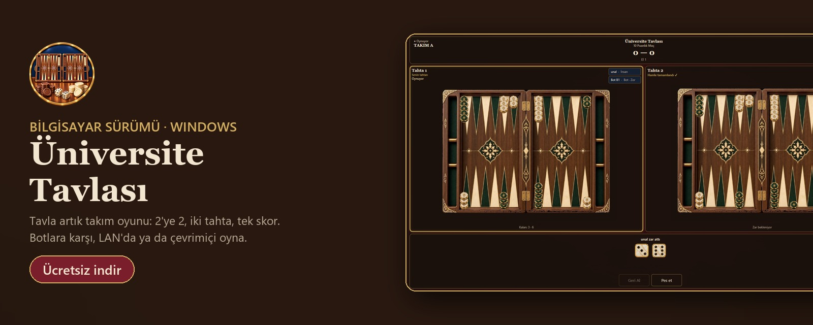
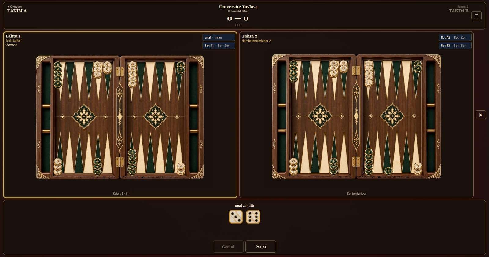
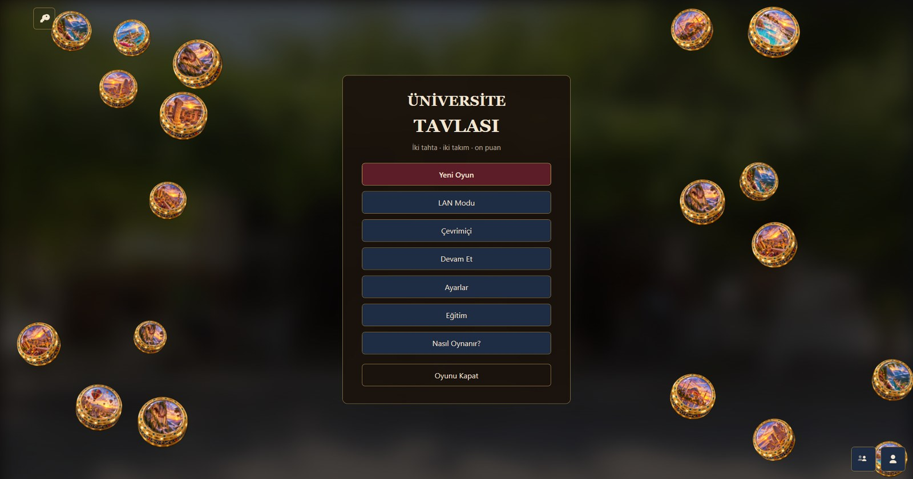
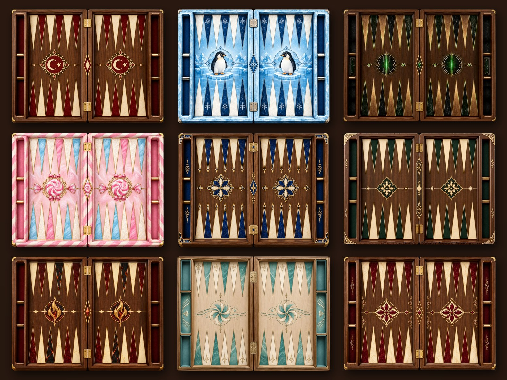

<p align="center">
  
</p>

<h1 align="center">Üniversite Tavlası</h1>

<p align="center">
  <b>Tavla artık takım oyunu.</b> 2'ye 2, iki tahta, tek skor.<br>
  Arkadaşınla aynı takımda, iki tahtada aynı anda oyna; skorları birleşsin.
</p>

<p align="center">
  <a href="https://github.com/unalbey10/universite-tavlasi/releases/latest"><b>⬇ Windows için ücretsiz indir</b></a>
  &nbsp;·&nbsp;
  <a href="https://unitavla.com/">unitavla.com</a>
</p>

---

## Nasıl bir oyun?

Üniversite Tavlası, klasik tavlanın takımla oynanan hâli. Dört oyuncu iki takıma ayrılır; her takımın bir oyuncusu **Tahta 1**'de, diğeri **Tahta 2**'de oynar. Zar takımın ortak zarıdır, iki tahtada kazanılan puanlar tek skorda toplanır. İlk **10 puana** ulaşan takım maçı kazanır.

- **2'ye 2 takım tavlası:** Arkadaşınla aynı takımda oyna, iki tahtayı birlikte yönetin.
- **İki tahta, tek skor:** Mars iki puan; her el takımın hanesine yazılır.
- **Klasik tavla da var:** Bire bir, tek tahtada geleneksel tavla.
- **Botlar:** Kolay, Normal ve Zor botlara karşı istediğin zaman oyna.
- **Çevrimiçi ve LAN:** Arkadaşlarını masaya davet et, dereceli oyna; aynı ağdaysanız internetsiz oynayın.
- **Telefonla aynı hesap:** Android'de açtığın hesapla bilgisayarda da giriş yap.
- **Temalar:** Türkiye, Penguen, Pamuk Şeker, Matrix ve daha fazlası.

## Ekran görüntüleri

<p align="center"></p>
<p align="center"></p>
<p align="center"></p>

## Kurulum

1. [Son sürüm](https://github.com/unalbey10/universite-tavlasi/releases/latest) sayfasından `UniversiteTavlasi-Setup-x.y.z.exe` dosyasını indir.
2. Dosyayı çalıştır ve kurulum adımlarını izle.
3. Windows "Bilgisayarınız korundu" uyarısı gösterirse **Ek bilgi → Yine de çalıştır**'a bas. Uygulama henüz dijital imzalı olmadığı için bu uyarı çıkıyor.

**Gereksinimler:** Windows 10 veya 11 (64 bit). Ek bir program kurmana gerek yok.

**Dosyanın doğruluğu:** Her sürümün SHA-256 özeti sürüm notlarında yazılıdır. Kontrol etmek için PowerShell'de:

```powershell
Get-FileHash .\UniversiteTavlasi-Setup-1.3.0.exe -Algorithm SHA256
```

## Destek

Öneri, hata ya da sorun için oyunun içindeki **Geri bildirim** bölümünü kullanabilir ya da bu sayfada [bir konu açabilirsin](https://github.com/unalbey10/universite-tavlasi/issues).

---

<p align="center">© BASGAMES · Üniversite Tavlası. Tüm hakları saklıdır.</p>
